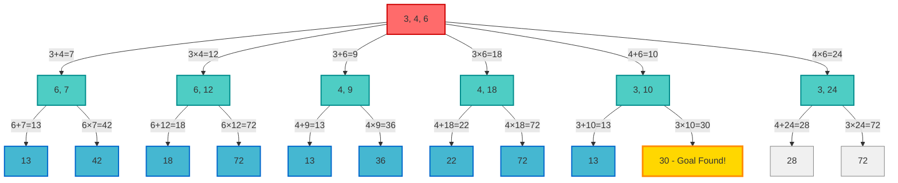

+++
date = '2025-08-25T13:23:05+01:00'
draft = true
title = 'Solving Number Problems with Artificial Intelligence'
tags = ['programming', '.net', 'artificial intelligence']
+++

In the UK, there is a popular gameshow called [Countdown](https://en.wikipedia.org/wiki/Countdown_(game_show)). The main thrust of the programme is to try to create the longest word from a randomly set of vowels and consonants pulled from two stacks of jumbled letters. Contestants get points for the length of the validated words and the individual with the most points - wins. For some light relief, there is a "Numbers Round". In this round the contestants are presented with six initial numbers and are given a target to reach. The six initial numbers are split into two groups; small numbers, between 1 and 10; large numbers, 25, 50, 75, or 100. Instead of pulling from stack, there is a board containing 20 small numbers (2 of each option) and one of each of the large numbers. The contestant driving the round requests, for example, 2 large and 4 small and are presented with a legal combination based on the rules above. A random number is then generated between 1 and 999, which may or may not be possible, and the contestants are given 30 seconds to attempt to solve the problem. In order to solve the problem, the contestants can only use the basic mathematical operations of (+, -, ×, and ÷) and the result of any individual operation must be a positive integer e.g. 1, 2, 3, 4, and so on. When a number has been used it cannot be reused, unless another copy of that number is still available.

For example. Imagine we have a board containing 75, 5, 6, 3, 2, 3 and a target of 277. Is this solvable, and if so, how?

6 - 2 = 4  
75 - 5 = 70  
4 × 70 = 280  
280 - 3 = 277  

This game is [credited](https://www.youtube.com/watch?v=piQ3q1n0ma8) as having been played on the 11th December 2024. While it is fun to spend the 30 seconds also trying to solve the problem. It's more fun to write some code so a computer can solve it for us!

### Artificial Intelligence (AI)

Ever since OpenAI's [ChatGPT](https://chatgpt.com/) was released in November 2022 the term "Artificial Intelligence" has become synonymous with "Large Language Model" which is a particular flavour of Deep Learning. What this has done is suck a lot of the oxygen out of the field and it's worth remembering that AI is more than LLMs.


Within the field of AI there are a number of Search algorithms which we can use to look (search) for a valid solution to any numbers round.

#### Search

When confronted with a scenario which has an initial state of the "world", a goal to get to, and some mechanism for expressing which actions can be performed to move from the current state to the next state then we can possibly apply one of many search algorithms to the problem. Search algorithms are categorised as either being uninformed or informed in nature. An uninformed search algorithm does not have access to a heuristic to aid in the selection of the action to take, the actions can have a cost. By contrast an informed search algorithm does have a heuristic. For example, if we consider a navigation problem in a city with a grid layout, a heuristic we might employ is the calculation of the [Manhattan Distance](https://en.wikipedia.org/wiki/Taxicab_geometry). Rather than calculate the straight line distance between the current location and the goal location, instead we add the number of east-west blocks to the number of north-south blocks (both as absolute values) to determine which path we should take. This allows selection of the next best state to be based on which option takes us closer to our goal.

For our number round solver, where a simple "distance to goal" heuristic isn't readily available, we shall make use of an uninformed search algorithm. As we'd like to find the "best" solution, where best is taken to mean the solution which takes the fewest computations, we shall make use of the Breadth First Search algorithm. To illustrate this, let's consider a simplified version of the numbers game. We shall set the constraints such that the initial state contains only three numbers and that only addition and multiplication are allowed. We shall set the target as being 30 and the numbers being 3, 4, and 6.



This tree structure illustrates the search space of the constrained problem. It contains the nodes (with the numbers available) and the edges describe the operation performed. Note: that many of the operation chains find paths to the same numbers (13, and 72). This is because both the addition and multiplication operators are [commutative](https://en.wikipedia.org/wiki/Commutative_property) so regardless if we add 3+4+6 or 3+6+4 or 4+6+3, we end up with 13. In all likelihood, we would only continue evaluating the next node if it had already been considered, or if it is already present in the collection of nodes to be considered. Nodes which have already been considered are said to have been explored. Nodes awaiting consideration are part of the frontier. In this diagram the two nodes coloured in grey are the frontier, but as we've found our goal of 30 we shall stop processing the frontier and yield the solution.

This method fully considers the frontier at a given level in the tree before considering the frontier at deeper levels. This is what makes this a breadth first search. The advantages of the breadth first search are that we can always find the optimal solution (in terms of operation count), but we do store more in memory. For the problem we are dealing with here, the search space is not excessively large or infinite. By contrasts a depth first search would operate via a LIFO data structure, this forces nodes to be considered towards leaf nodes. In the example above, this would mean that the two unvisited frontier nodes would not have been discovered. This save two nodes from existing in the frontier. This doesn't save a lot of consideration here, but if we mentally think about the unconstrained variant of the problem, with six numbers and four operations, we can quickly save many more nodes from being stored. Depth first searches are typically more efficient in terms of space complexity, but may not yield the optimal solution. An iterative depth first search can be used to limit the depth considered, this allows use to still benefit from depth first search but still find the optimal solution. Perhaps, an extension for the future.

Before we start implementing our solution, let us discuss the following pseudo-code outlining the algorithm.

```lang-none
function BREADTH-FIRST-SEARCH(problem) returns a solution, or failure
  node ← a node with STATE = problem. INITIAL-STATE, PATH-COST = 0
  if problem.GOAL-TEST(node.STATE) then return SOLUTION(node)
  frontier ← a FIFO queue with node as the only element
  explored ← an empty set
  loop do
    if EMPTY?(frontier) then return failure
    node ← POP(frontier) /* choose the shallowest node in frontier */
    add node.STATE to explored
    for each action in problem.ACTIONS(node.STATE) do
      child ← CHILD-NODE(problem, node, action)
      if child.STATE is not in explored or frontier then
        if problem.GOAL-TEST(child.STATE) then return SOLUTION(child)
        frontier ← INSERT(child, frontier)
```
> Artificial Intelligence - A Modern Approach[^aimodernapproach3ed]

### References
[^aimodernapproach3ed]: [Artificial Intelligence - A Modern Approach 3rd Edition by Stuart Russell &amp; Peter Norvig](https://www.amazon.co.uk/Artificial-Intelligence-Modern-Approach-Prentice/dp/0136042597)
