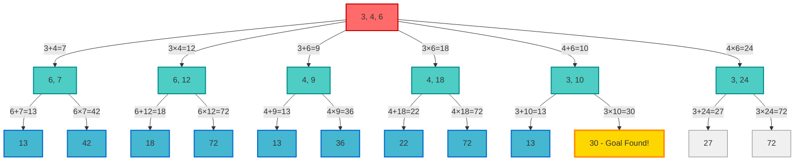
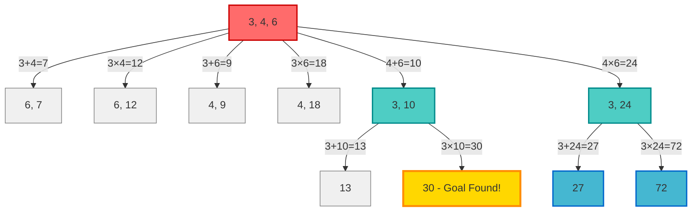

+++
date = '2025-11-30T00:00:00+00:00'
draft = true
title = 'Exploring Depth First Search'
tags = ['programming', '.net', 'artificial intelligence']
+++

In [my last blog post](../solving-number-problems-with-ai) we developed an MCP server which could solve the Number Round segments from the popular UK gameshow [Countdown](https://en.wikipedia.org/wiki/Countdown_(game_show)). The implementation used an uninformed search algorithm called Breadth First Search. During that implementation, I mentioned that while breadth first search will find the optimal solution, it does so at a potentially significant cost. In search spaces where there are many possible next states from an initial state the breadth first search algorithm will fully expand each level of the search space. Using a number round example of 1, 4, 4, 5, 6, 50 and a target of 350 let's explore how big a problem this could be.

In the implementation we explored last time out, we know that the generation of possible states will emit the following options:

+, -, ×, and ÷

| i | j | ithOperandValue | jthOperandValue | Operation | Next State |
|-|-|-|-|-|-|
| 0 | 1 | 1 | 4 | + | 4, 5, 5, 6, 50 |
| 0 | 1 | 1 | 4 | × | 4, 4, 5, 6, 50 |
| 0 | 1 | 1 | 4 | - | 3, 4, 5, 6, 50 |
| 0 | 1 | 1 | 4 | ÷ | 4, 4, 5, 6, 50 |
| 0 | 2 | 1 | 4 | + | 4, 5, 5, 6, 50 |
| 0 | 2 | 1 | 4 | × | 4, 4, 5, 6, 50 |
| 0 | 2 | 1 | 4 | - | 3, 4, 5, 6, 50 |
| 0 | 2 | 1 | 4 | ÷ | 4, 4, 5, 6, 50 |
| 0 | 3 | 1 | 5 | + | 4, 4, 6, 6, 50 |
| 0 | 3 | 1 | 5 | × | 4, 4, 5, 6, 50 |
| 0 | 3 | 1 | 5 | - | 4, 4, 4, 6, 50 |

Note: the exploration of the search space is quite extensive containing over 3,200 rows.

All of the first level of the search space is added to the frontier before any of the nodes on that level are explored. For this problem, there are 50 nodes after the expansion of the first level alone. Each of the next level nodes are placed in the Queue used to store the frontier, during the solve for this problem this queue grows to 1,141 items. The benefit for Breadth First Search is that we find the optimal solution, but it comes at a cost, our memory consumption is typically higher.

## Depth First Search

As we learned last time out, the reason that the Breadth First Search processes the search space in discovery order is that it stores the frontier in a FIFO data structure (specifically a Queue), to cause the Depth First Search behaviour, we need to replace the FIFO data structure with a LIFO data structure i.e. a Stack. That's it, that's all the change we need. By processing the item most recently added to the frontier we are forcing the search space to be explored towards leaf nodes before working back up the levels. We still want to support both strategies so we can compare them, so let's start by adding a simple interface which both of our search strategies will implement.

```csharp
public interface ISearch<TState, TStateTraversalDescription>
{
    IEnumerable<StateTraversal<TState, TStateTraversalDescription>> Execute(TState initialState);
}

public class BreadthFirstSearch<TState, TStateTraversalDescription> : ISearch<TState, TStateTraversalDescription>
    where TStateTraversalDescription : class
{
    // Redacted
}
```

Now, let's add an implementation of the Depth First Search algorithm, it's the same as the Breadth First Search algorithm but uses a Stack instead of a Queue.

```csharp
public class DepthFirstSearch<TState, TStateTraversalDescription> : ISearch<TState, TStateTraversalDescription>
    where TStateTraversalDescription : class
{
    private readonly Predicate<TState> _successIndicator;

    private readonly Func<StateTraversal<TState, TStateTraversalDescription>, IEnumerable<StateTraversal<TState, TStateTraversalDescription>>> _nextStateGenerator;

    private readonly Stack<StateTraversal<TState, TStateTraversalDescription>> _frontier;
    private readonly HashSet<TState> _explored;
    private readonly IEqualityComparer<TState> _stateComparer;

    public DepthFirstSearch(
        Predicate<TState> successIndicator,
        Func<StateTraversal<TState, TStateTraversalDescription>, IEnumerable<StateTraversal<TState, TStateTraversalDescription>>> nextStateGenerator,
        IEqualityComparer<TState> stateComparer)
    {
        _successIndicator = successIndicator;
        _nextStateGenerator = nextStateGenerator;
        _frontier = new Stack<StateTraversal<TState, TStateTraversalDescription>>();
        _explored = new HashSet<TState>(stateComparer);
        _stateComparer = stateComparer;
    }

    public IEnumerable<StateTraversal<TState, TStateTraversalDescription>> Execute(TState initialState)
    {
        _frontier.Push(new StateTraversal<TState, TStateTraversalDescription>(
            null,
            null,
            initialState));

        while (_frontier.TryPop(out var candidate))
        {
            _explored.Add(candidate.Child);

            if (_successIndicator(candidate.Child))
            {
                yield return candidate;
            }

            foreach (var additionalCandidate in _nextStateGenerator(candidate))
            {
                if (!_frontier.Select(f => f.Child).Any(s => _stateComparer.Equals(s, additionalCandidate.Child))
                    && !_explored.Contains(additionalCandidate.Child))
                {
                    _frontier.Push(additionalCandidate);
                }
            }
        }
    }
}
```

As there are relatively few changes, let's briefly discuss them:

- The `_frontier` field is now an instance of `Stack<StateTraversal<TState, TStateTraversalDescription>>`
  - We use `.Push` to add new state traversals onto the frontier
  - We use `.TryPop` when attempting to extract the next state traversal to process from the frontier

That's it, that's all we need to change to move from Breadth First to Depth First but why does this work, how can such a simple change make such a difference? Let's explore this with the same example we used last time out. We have the target of 30 and the numbers 3, 4, and 6 but we can only apply the + and × operations.

### Exploring the Search Space with a Queue

As a Queue is referred to as a FIFO (first in first out) data structure, this means that the nodes added to the frontier are processed in the order that they were discovered. Starting at "level 0" with the numbers [ 3, 4, 6 ] we add that root node to the queue, it is the only item in the queue. As such, we explore it and add the following nodes to the frontier - [ 6, 7 ] [ 6, 12 ] [ 4, 9 ] [ 4, 18 ] [ 3, 10 ], and [ 3, 24 ]. When we next select a node, we take the one from the queue that was added first. This is the node [ 6, 7 ] and we explore that node add the nodes [ 13 ], [ 42 ] to the queue. The queue-based frontier now contains [ 6, 12 ] [ 4, 9 ] [ 4, 18 ] [ 3, 10 ], [ 3, 24 ], [ 13 ], and [ 42 ]. As you can see, as we take nodes out of the frontier, any node found by exploring them is added to the end of the queue. If we continued the experiment, we'd locate the goal as shown below.



We locate the goal after considering 17 nodes (including the initial state of the problem) in the restricted version of the problem.

### Exploring the Search Space with a Stack

When we use a Stack, a Last In First Out (LIFO) data structure, we get a very different exploration pattern. We still start from the same initial state of [ 3, 4, 6 ] and we also limit ourselves to he + and × operations only. The frontier is formed by pushing the initial state onto the stack, it has a single element which we pop off the stack and explore leading the values [ 6, 7 ] [ 6, 12 ] [ 4, 9 ] [ 4, 18 ] [ 3, 10 ], and [ 3, 24 ] to pushed on to the stack in order. We must pop the most recently added item ([ 3, 24 ]) off the stack and explore it adding [ 28 ] and [ 72 ] which are pushed onto the stack in order. Again we pop the most recently added node off ([ 72 ]) the stack, realising it does not meet the goal of 30, continue processing the frontier discovering that [ 28 ] also doesn't meet the goal. Next up is [ 3, 10 ] which is explored adding [ 13 ] and [ 30 ] to the frontier. We pop [ 30 ] off the stack and we have our goal.



The goal was located after considering 6 nodes and the frontier experienced a max size of only 69, a great improvement but remember this is really problem dependent. It's not all positive for Depth First Search though, let's see how our test cases execute.

### Running the Tests

We have a collection of tests that check that the numbers round can be solved for varying levels of difficulty, all the way from already solved to impossible. Currently our solver is hard coded to always use the original breadth first search solution from the previous post. Let's allow different strategies to be applied by added an interface and using an enum to toggle the algorithm used.

```csharp
public enum SearchStrategy
{
    BreadthFirst,
    DepthFirst
}

public interface ISearch<TState, TStateTraversalDescription>
{
    IEnumerable<StateTraversal<TState, TStateTraversalDescription>> Execute(TState initialState);
}

// Update the Solver class to make use of the new interface and searchStrategy enum.
ISearch<Board, MathematicalOperation> search = searchStrategy switch
{
    SearchStrategy.BreadthFirst => new BreadthFirstSearch<Board, MathematicalOperation>(
        b => b.Options.Any(n => n.Value == target.Value),
        t => t.GeneratePossibleActions(),
        new BoardEqualityComparer()),
    SearchStrategy.DepthFirst => new DepthFirstSearch<Board, MathematicalOperation>(
        b => b.Options.Any(n => n.Value == target.Value),
        t => t.GeneratePossibleActions(),
        new BoardEqualityComparer())
    _ => throw new ArgumentOutOfRangeException(nameof(searchStrategy), searchStrategy, "Unsupported search strategy.")
};
```

We can now update the xUnit Theory to have use the different strategies and check that solutions can be found.

```csharp
[Theory]
[InlineData(new[] { 1, 2, 3, 4, 5, 6 }, 12, SearchStrategy.BreadthFirst, 3)]
[InlineData(new[] { 1, 2, 3, 4, 5, 6 }, 12, SearchStrategy.DepthFirst, 4)]
[InlineData(new[] { 1, 4, 4, 5, 6, 50 }, 350, SearchStrategy.BreadthFirst, 4)]
[InlineData(new[] { 1, 4, 4, 5, 6, 50 }, 350, SearchStrategy.DepthFirst, 7)]
[InlineData(new[] { 1, 3, 3, 8, 9, 50 }, 410, SearchStrategy.BreadthFirst, 5)]
[InlineData(new[] { 1, 3, 3, 8, 9, 50 }, 410, SearchStrategy.DepthFirst, 7)]
[InlineData(new[] { 2, 3, 3, 5, 6, 75 }, 277, SearchStrategy.BreadthFirst, 6)]
[InlineData(new[] { 2, 3, 3, 5, 6, 75 }, 277, SearchStrategy.DepthFirst, 7)]
[InlineData(new[] { 1, 10, 25, 50, 75, 100 }, 813, SearchStrategy.BreadthFirst, 7)]
[InlineData(new[] { 1, 10, 25, 50, 75, 100 }, 813, SearchStrategy.DepthFirst, 7)]
public void A_Possible_Puzzle_Is_Reported_As_Such_With_Solution(int[] numbers, int target, SearchStrategy searchStrategy, int expectedSolutionSteps)
{
    // Arrange
    var board = Board.From(numbers);
    
    var sut = new Solver();

    // Act
    var result = sut.Solve(board, new Target(target), searchStrategy);

    // Assert
    result.SolutionFound.ShouldBeTrue();
    result.Instructions.Count.ShouldBe(expectedSolutionSteps);
}
```

The keen-eyed among you will have noticed that the `expectedSolutionSteps` is often different dependent on the strategy being used. This is part of the trade off between Breadth and Depth first search. Depth first is not guaranteed to find an optimal solution as it doesn't check all the possibilities at a given level in the search space in order. Let's investigate with the problem targeting 350 with the numbers [ 1, 4, 4, 5, 6, 50 ] on the initial board.

| Breadth First Search | Depth First Search |
|-|-|
| 1 + 6 => [ 4, 4, 5, *7*, 50 ] | 6 × 50 => [ 1, 4, 4, 5, *300* ] |
| 7 × 50 => [ 4, 4, 5, **350** ] | 300 ÷ 4 => [ 1, 4, 5, *75* ] |
| | 75 - 5 => [ 1, 4, *70* ] |
| | 1 + 4 => [ *5*, 70 ] |
| | 5 × 70 => [ **350** ]|

Both of these solutions are valid, but one is significantly fewer steps than the other. Let's consider another option.

## Iterative Deepening Search

What if we could take advantage of the (comparative) memory efficiency of depth first search but also the guarantee of finding optimal solutions provided by breadth first search? Iterative Deepening Search makes this possible by operating as a Depth First Search while stopping navigating into the search space too deeply upon each iteration.

This is achieved by having a simple loop after the depth first search process. Within the loop we have set the maximum depth that can be explored. As nodes are removed from the frontier become explored, if the newly discovered nodes have a depth that exceed the current maximum depth, they are discarded. This causes the algorithm to execute multiple passes through the search space, performing the same computations again and again, but this allows each of the levels in our search space to be fully considered during the overall execution cycle.

Implementing this is fairly trivial and involves encapsulating the creation of both the frontier and explored collections within a loop (as it is important that each exploration of the search space has no memory of the previous less thorough exploration). If a solution is found within the depth constraints of the current exploration, it can be yielded as an optimal solution, if not we increment the maximum depth and try again with a new frontier and explored collection.

If we implement this and extend our tests for this new strategy we can see that both the Depth First and Iterative Deepening approaches agree on the number of steps to a solution. Be aware that the solutions may differ as multiple solutions could exist at the same depth in the search space. As Breadth First search uses a Queue and Iterative Deepening uses a Stack the levels will be explored from the opposite ends.

```csharp
[Theory]
[InlineData(new[] { 1, 2, 3, 4, 5, 6 }, 12, SearchStrategy.BreadthFirst, 3)]
[InlineData(new[] { 1, 2, 3, 4, 5, 6 }, 12, SearchStrategy.DepthFirst, 4)]
[InlineData(new[] { 1, 2, 3, 4, 5, 6 }, 12, SearchStrategy.IterativeDeepeningDepthFirst, 3)]
[InlineData(new[] { 1, 4, 4, 5, 6, 50 }, 350, SearchStrategy.BreadthFirst, 4)]
[InlineData(new[] { 1, 4, 4, 5, 6, 50 }, 350, SearchStrategy.DepthFirst, 7)]
[InlineData(new[] { 1, 4, 4, 5, 6, 50 }, 350, SearchStrategy.IterativeDeepeningDepthFirst, 4)]
[InlineData(new[] { 1, 3, 3, 8, 9, 50 }, 410, SearchStrategy.BreadthFirst, 5)]
[InlineData(new[] { 1, 3, 3, 8, 9, 50 }, 410, SearchStrategy.DepthFirst, 7)]
[InlineData(new[] { 1, 3, 3, 8, 9, 50 }, 410, SearchStrategy.IterativeDeepeningDepthFirst, 5)]
[InlineData(new[] { 2, 3, 3, 5, 6, 75 }, 277, SearchStrategy.BreadthFirst, 6)]
[InlineData(new[] { 2, 3, 3, 5, 6, 75 }, 277, SearchStrategy.DepthFirst, 7)]
[InlineData(new[] { 2, 3, 3, 5, 6, 75 }, 277, SearchStrategy.IterativeDeepeningDepthFirst, 6)]
[InlineData(new[] { 1, 10, 25, 50, 75, 100 }, 813, SearchStrategy.BreadthFirst, 7)]
[InlineData(new[] { 1, 10, 25, 50, 75, 100 }, 813, SearchStrategy.DepthFirst, 7)]
[InlineData(new[] { 1, 10, 25, 50, 75, 100 }, 813, SearchStrategy.IterativeDeepeningDepthFirst, 7)]
public void A_Possible_Puzzle_Is_Reported_As_Such_With_Solution(int[] numbers, int target, SearchStrategy searchStrategy, int expectedSolutionSteps)
{
    // Arrange
    var board = Board.From(numbers);
    
    var sut = new Solver();

    // Act
    var result = sut.Solve(board, new Target(target), searchStrategy);

    // Assert
    result.SolutionFound.ShouldBeTrue();
    result.Instructions.Count.ShouldBe(expectedSolutionSteps);
}
```

How much does the extra work undertaken by this approach cost us? Let's take a naïve look by just checking the test execution times for the hardest puzzle we have here. This is the puzzle with the board set to [ 1, 10, 25, 50, 75, 100 ] and a target of 813.

| Strategy | Elapsed Time |
|-|-|
| Breadth First Search | 45s 92ms |
| Breadth First Search (without node de-duplication) | 3s 812ms |
| Depth First Search | 72ms |
| Iterative Deepening Search | 372ms |

If you recall, as part of the Breadth First Search implementation we checked each discovered node against both the frontier and explored collections and did not add the new node to the frontier if a node with the same contents had already been considered, or queued for future consideration. This is to prevent wasted effort in scenarios where the same node can be found in multiple ways. With the Breadth First Search taking so much longer than either of the other two options, I temporarily commented out that check and re-ran the tests. It is still significantly slower than the other strategies.

Before we jump to too many conclusions however, we should try to obtain some better benchmarks. For that we will turn to an open source project - [BenchmarkDotNet](https://benchmarkdotnet.org/).

## Benchmarking Our Strategies

Taking a single execution of a handful of tests and basing opinions from that limited dataset can be extremely problematic. A single execution could be subject to unfortunate time slicing as a higher priority task is allocated CPU cycles over it. Executing a Debug build will cause the code to not be optimised. We need a more rigorous approach. This is where BenchmarkDotNet comes in.

> BenchmarkDotNet helps you to transform methods into benchmarks, track their performance, and share reproducible measurement experiments. It's no harder than writing unit tests! Under the hood, it performs a lot of magic that guarantees reliable and precise results thanks to the perfolizer and pragmastat statistical engine. BenchmarkDotNet protects you from popular benchmarking mistakes and warns you if something is wrong with your benchmark design or obtained measurements. The results are presented in a user-friendly form that highlights all the important facts about your experiment. BenchmarkDotNet is already adopted by 27400+ GitHub projects including .NET Runtime, .NET Compiler, .NET Performance, and many others.

-- from [https://benchmarkdotnet.org/](https://benchmarkdotnet.org/)

To create our benchmarks we need a console app project and reference the [BenchmarkDotNet nuget package](https://www.nuget.org/packages/BenchmarkDotNet). The `Program.cs` file is very simple:

```csharp
using BenchmarkDotNet.Running;
using PuzzleSolver.Benchmarks;

BenchmarkRunner.Run<NumbersGameBenchmarks>();
```

We have a number of different strategies, so within our `NumbersGameBenchmarks` class we simply decorate three methods with the `[Benchmark]` attribute and nominate one as the baseline. For this scenario, we have set the Breadth First Search implementation as the baseline. We suspect that the amount of time it will take to solve a given problem is related to the configuration of the numbers round. From configurations that are already solved, to those which are impossible. We will categorise these and place an example of each category into a collection which is served up via a `[ParamsSource]` property.

```csharp
using BenchmarkDotNet.Attributes;
using PuzzleSolver.NumbersGame;

namespace PuzzleSolver.Benchmarks;

public class NumbersGameBenchmarks
{
    public IEnumerable<Configuration> Configurations()
    {
        yield return new Configuration(ConfigurationDifficulty.AlreadySolved, Board.From([ 1, 2, 3, 4, 5, 100 ]), new Target(100));
        yield return new Configuration(ConfigurationDifficulty.Easy, Board.From([ 1, 4, 4, 5, 6, 50 ]), new Target(350));
        yield return new Configuration(ConfigurationDifficulty.Medium, Board.From([ 1, 3, 3, 8, 9, 50 ]), new Target(410));
        yield return new Configuration(ConfigurationDifficulty.Hard, Board.From([ 1, 10, 25, 50, 75, 100 ]), new Target(813));
        yield return new Configuration(ConfigurationDifficulty.Impossible, Board.From([ 3, 7, 6, 2, 1, 7 ]), new Target(824));
    }

    [ParamsSource(nameof(Configurations))]
    public Configuration Configuration { get; set; } = null!;

    [Benchmark(Baseline = true)]
    public void UsingBreadthFirstSearch()
    {
        var solver = new Solver();
        var solution = solver.Solve(Configuration.Board, Configuration.Target, SearchStrategy.BreadthFirst);
    }
    
    [Benchmark]
    public void UsingDepthFirstSearch()
    {
        var solver = new Solver();
        var solution = solver.Solve(Configuration.Board, Configuration.Target, SearchStrategy.DepthFirst);
    }
    
    [Benchmark]
    public void UsingIterativeDepthFirstSearch()
    {
        var solver = new Solver();
        var solution = solver.Solve(Configuration.Board, Configuration.Target, SearchStrategy.IterativeDeepeningDepthFirst);
    }
}

public record Configuration(ConfigurationDifficulty Difficulty, Board Board, Target Target)
{
    public string Name => Enum.GetName(Difficulty)!;

    public override string ToString()
    {
        return Name;
    }
}

public enum ConfigurationDifficulty
{
    AlreadySolved,
    Easy,
    Medium,
    Hard,
    Impossible
}
```

Once we have this configured, we need to make sure we build the benchmark project in Release configuration and then execute the console app. I've included the full output [here](/posts/2025/11/BenchmarkResults.txt), but here are the final results.

| Method | Configuration | Mean | Error | StdDev | Ratio | RatioSD |
|-|-|-|-|-|-|-|
| UsingBreadthFirstSearch | AlreadySolved | 97.74ns | 1.959ns | 4.381ns | 1.00 | 0.06 |
| UsingDepthFirstSearch | AlreadySolved | 97.25ns | 1.859ns | 2.140ns | 1.00 | 0.05 |
| UsingIterativeDepthFirstSearch | AlreadySolved | 107.40ns | 2.067ns | 2.298ns | 1.10 | 0.05 |
| | | | | | | |
| UsingBreadthFirstSearch | Easy | 10,055,711.77ns | 150,984.664ns | 141,231.149ns | 1.00 | 0.02 |
| UsingDepthFirstSearch | Easy | 2,144,027.34ns | 34,036.357ns | 31,837.630ns | 0.21 | 0.00 |
| UsingIterativeDepthFirstSearch | Easy | 1,415,575.28ns | 17,238.511ns | 15,281.491ns | 0.14 | 0.00 |
| | | | | | | |
| UsingBreadthFirstSearch | Medium | 291,921,270.00ns | 5,784,124.818ns | 6,661,006.744ns | 1.000 | 0.03 |
| UsingDepthFirstSearch | Medium | 952,062.46ns | 12,446.396ns | 11,642.367ns | 0.003 | 0.00 |
| UsingIterativeDepthFirstSearch | Medium | 3,380,150.73ns | 40,800.667ns | 36,168.729ns | 0.012 | 0.00 |
| | | | | | | |
| UsingBreadthFirstSearch | Hard | 6,797,383,225.00ns | 62,266,551.311ns | 48,613,627.555ns | 1.000 | 0.01 |
| UsingDepthFirstSearch | Hard | 14,904,705.47ns | 282,994.223ns | 325,896.568ns | 0.002 | 0.00 |
| UsingIterativeDepthFirstSearch | Hard | 82,944,535.71ns | 1,655,015.522ns | 1,467,128.153ns | 0.012 | 0.00 |
| | | | | | | |
| UsingBreadthFirstSearch | Impossible | 168,049,185.00ns | 2,584,751.732ns | 2,417,778.375ns | 1.00 | 0.02 |
| UsingDepthFirstSearch | Impossible | 15,537,306.25ns | 227,337.304ns | 189,836.945ns | 0.09 | 0.00 |
| UsingIterativeDepthFirstSearch | Impossible | 34,719,409.56ns | 690,594.467ns | 1,033,649.366ns | 0.21 | 0.01 |

Let's take a look at the relative performance per problem difficulty to get a sense as to which approach we should use, we'll set the baseline as BreadthFirstSearch.

| Configuration | Breadth First Search | Depth First Search | Iterative Depth First Search |
|-|-|-|-|
| AlreadySolved | 100% | 99.50% | 109.88% |
| Easy | 100% | 21.32% | 14.08% |
| Medium | 100% | 0.33% | 1.16% |
| Hard | 100% | 0.22% | 1.22% |
| Impossible | 100% | 9.25% | 20.66% |

From these results, and these problem scenarios, it is clear that leveraging Breadth First Search is difficult to defend. Once that option is ruled out we then need to focus on the following question:

> Do we need to find a solution, or a solution with the fewest steps?

## Conclusion

If you don't need the solution with the fewest steps, depth first search is a great choice. If, however, finding the solution with the fewest steps then applying the iterative deepening approach seems to be the most sensible choice. But, it's difficult to know if this holds true for all possible board configurations or indeed for other problems which suit an uninformed search based solution.

By using tools like BenchmarkDotNet we can make decisions based on data rather than gut feel.
